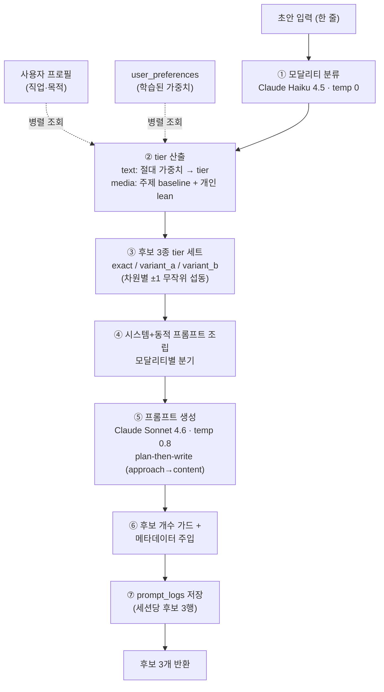
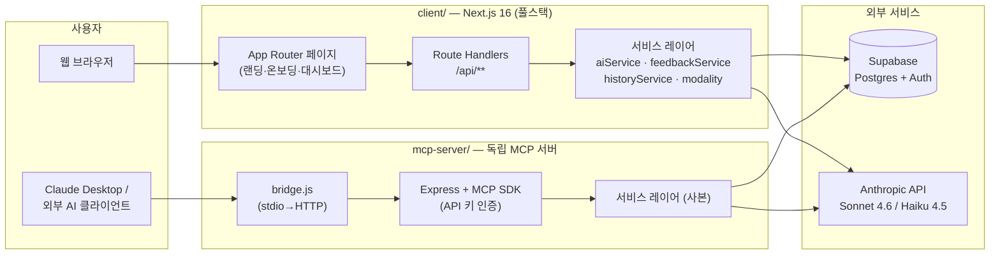

# Prompt-U

> **누구나 좋은 프롬프트를 — 당신의 취향을 학습하는 개인화 AI 프롬프트 제너레이터**

거칠게 적은 한 줄 초안을, 사용자의 선호도를 학습한 AI가 **타겟 AI에 바로 붙여넣을 수 있는 완성형 프롬프트**로 다듬어 줍니다. 텍스트뿐 아니라 이미지·영상·음악 생성 AI까지, 초안의 의도를 자동으로 감지해 각 도구에 맞는 프롬프트를 만들어 냅니다.

<p>
  
  
  
  
  
  
</p>

> 🎓 한성대학교 2026 캡스톤 디자인 · **팀 NuN**

---

## 목차

- [한눈에 보기](#한눈에-보기)
- [무엇을 해결하나요](#무엇을-해결하나요)
- [핵심 기능](#핵심-기능)
- [멀티모달 개인화 엔진](#멀티모달-개인화-엔진)
- [시스템 아키텍처](#시스템-아키텍처)
- [기술 스택](#기술-스택)
- [디렉토리 구조](#디렉토리-구조)
- [시작하기](#시작하기)
- [데이터베이스 스키마](#데이터베이스-스키마)
- [API 요약](#api-요약)
- [MCP 서버 연동](#mcp-서버-연동-claude-desktop-등)
- [화면 라우팅](#화면-라우팅)
- [문서](#문서)
- [팀](#팀)

---

## 한눈에 보기

| 구분 | 내용 |
| :--- | :--- |
| **프로젝트** | Prompt-U — 개인화 AI 프롬프트 제너레이터 |
| **형태** | 모노레포 (웹 앱 + 독립 MCP 서버 + DB 마이그레이션) |
| **프론트엔드 / API** | Next.js 16 App Router (풀스택, Route Handlers로 API 제공) |
| **인증 / DB** | Supabase (Postgres + Auth, RLS 적용) |
| **생성 모델** | Claude Sonnet 4.6 (프롬프트 생성) · Claude Haiku 4.5 (모달리티 분류) |
| **확장 채널** | MCP 서버 — Claude Desktop 등 외부 AI 클라이언트에서 개인 API 키로 접속 |

---

## 무엇을 해결하나요

좋은 결과물을 얻으려면 좋은 프롬프트가 필요하지만, 대부분의 사용자는

1. **프롬프트를 잘 쓰는 법을 모르고** — 무엇을, 어떤 구조로, 어떤 톤으로 적어야 할지 막막합니다.
2. **취향이 매번 무시되고** — 늘 "더 간결하게", "전문가용으로"를 반복해서 덧붙여야 합니다.
3. **도구마다 문법이 다릅니다** — ChatGPT에 쓰는 지시서와 Midjourney·Suno에 넣는 묘사형 프롬프트는 완전히 다릅니다.

Prompt-U는 이 세 가지를 한 번에 해결합니다.

- 한 줄 초안만 넣으면 **구조화·보강된 완성형 프롬프트**가 나옵니다.
- 마음에 든 결과에 **좋아요**를 누르면 그 취향이 가중치로 **누적 학습**되어, 다음 생성부터 자동 반영됩니다.
- 초안의 의도를 분석해 **텍스트 / 이미지 / 영상 / 음악** 중 맞는 모달리티를 골라, 각 타겟 AI에 맞는 형식으로 만들어 줍니다.

---

## 핵심 기능

- **🎯 초안 → 완성형 프롬프트 변환** — 거친 한 줄을 역할·맥락·작업·제약·출력형식이 갖춰진 프롬프트로 보강합니다.
- **🧠 선호도 학습 (좋아요 기반)** — 좋아요 한 번이 모달리티별 4개 차원의 가중치에 반영되어 개인화가 점점 정교해집니다.
- **🪄 모달리티 자동 감지** — 초안이 영상/이미지/음악 생성용이면, 지시서가 아니라 **그대로 붙여넣는 묘사형 프롬프트**를 생성합니다.
- **🔀 후보 3종 제시** — 선호 정확 반영(`exact`) + 변형 2종(`variant_a/b`)을 함께 보여줘 탐색의 폭을 넓힙니다.
- **📊 가중치 시각화** — 학습된 취향을 차원별로 시각적으로 확인합니다 (`/dashboard/analytics`).
- **🕘 히스토리** — 생성 세션을 저장·재조회·삭제합니다.
- **🌐 한/영 i18n + 표시 번역** — UI 언어 전환과, 영어 미디어 프롬프트의 한국어 표시 번역(원문 보존)을 지원합니다.
- **🔌 MCP 연동** — 개인 API 키를 발급해 Claude Desktop 등에서 Prompt-U를 도구로 호출합니다.
- **🔐 인증·권한·한도** — Supabase 세션(이메일·Google OAuth), RLS, 일일 생성 한도(기본 10회/일, KST 기준).

---

## 멀티모달 개인화 엔진

Prompt-U의 심장부입니다. 생성 AI는 결과물을 직접 만드는 게 아니라, **타겟 AI를 제어할 프롬프트를 만드는 "컴파일러"** 로 동작합니다.

> 📎 전체 설계 명세: [`client/src/lib/services/information.md`](client/src/lib/services/information.md)
> 단일 출처(스니펫·시스템 프롬프트 원문): [`client/src/lib/services/aiService.ts`](client/src/lib/services/aiService.ts), [`modality.ts`](client/src/lib/services/modality.ts)

### 1) 모달리티 × 4차원 모델

초안을 먼저 Haiku로 분류하고, 그 모달리티에 맞는 4개 차원(각 1~5 tier)으로 개인화합니다.

| 모달리티 | 차원 (4개) | 생성물 성격 |
| :--- | :--- | :--- |
| `text` | 어투 · 어휘 수준 · 정보 밀도 · 창의성 | ChatGPT/Claude용 **구조화 지시서** (`<Role>`/`<Context>`/`<Task>`/`<Constraints>`/`<OutputFormat>`) |
| `image` | 화풍 · 디테일 · 조명 · 색감 | Midjourney/DALL·E/SD용 **묘사형 프롬프트** |
| `video` | 카메라 · 페이싱 · 질감 · 분위기 | Sora/Runway/Veo/Kling용 **묘사형 프롬프트** |
| `music` | 템포 · 에너지 · 편성 · 장르 | Suno/Udio용 **묘사형 프롬프트** |

각 (모달리티, 차원, tier)마다 한/영 지시문 스니펫이 정의되어 있으며, 중립(Tier 3)은 빈 문자열로 두어 토큰을 절약합니다.

### 2) 생성 파이프라인



### 3) 가중치 학습 (좋아요 → 선호도)

후보에 **처음 좋아요**를 눌렀을 때만 가중치가 반영됩니다(`is_weight_applied` 플래그로 중복 방지).

- **텍스트** — 절대 가중치 EMA: `새 점수 = (기존 + tier 대표점수) / 2`
  - 대표 점수: `1→0.25, 2→0.65, 3→1.0, 4→1.35, 5→1.75` (범위 0.0~2.0)
- **미디어(image/video/music)** — **잔차(lean) 학습**: 절대 tier가 아니라 "주제 baseline으로부터의 편차"를 누적합니다.
  - `새 lean = clamp±1((기존 lean + (적용 tier − baseline)) / 2)`
  - 서로 다른 주제라도 baseline 대비 같은 방향이면 강화됩니다 (예: "항상 더 시네마틱하게" 같은 성향).

`user_preferences.category` 키 규칙(`prefKey`): 텍스트는 평면 키(`tone`, `level`…)로 기존 데이터와 호환, 미디어는 `모달리티.차원` 네임스페이스(`video.camera`…)로 충돌을 방지합니다.

---

## 시스템 아키텍처



**두 개의 진입 채널, 하나의 엔진:**

- **웹 앱(`client/`)** — 사용자가 쓰는 메인 채널. Next.js Route Handlers가 API까지 담당하며, **Supabase 세션 쿠키**로 인증합니다. *(과거의 별도 Express `server/`는 제거되었습니다.)*
- **MCP 서버(`mcp-server/`)** — Claude Desktop 같은 외부 AI 클라이언트가 **개인 API 키**로 접속하는 독립 채널. 생성·피드백 로직은 `client`와 동일한 서비스 코드를 사본으로 유지합니다.

---

## 기술 스택

### client/ (웹 앱 + API)

| 영역 | 기술 |
| :--- | :--- |
| 프레임워크 | Next.js `16.2.1` (App Router, React Compiler) |
| 런타임/언어 | React `19.2.4`, TypeScript `5` |
| 스타일링 | Tailwind CSS `v4` |
| AI | `ai` v6 (Vercel AI SDK) + `@ai-sdk/anthropic` v3 |
| 인증/DB | `@supabase/ssr`, `@supabase/supabase-js` |
| 상태/데이터 | `@tanstack/react-query` |
| 검증 | `zod` v4 |
| 아이콘 | `lucide-react` |

### mcp-server/ (MCP 서버)

| 영역 | 기술 |
| :--- | :--- |
| 런타임/언어 | Node.js, TypeScript `5` (ES2022 / NodeNext) |
| 서버 | `express` 4, `helmet`, `ws` |
| MCP | `@modelcontextprotocol/sdk` v1 (StreamableHTTP) |
| AI / DB | `@ai-sdk/anthropic`, `ai`, `@supabase/supabase-js` |
| 인증 | 개인 API 키 (SHA-256 해시 검증) |

---

## 디렉토리 구조

```
HS_2026_Capstone_NuN/
├── client/                      # Next.js 16 풀스택 앱 (프론트엔드 + API)
│   └── src/
│       ├── app/
│       │   ├── api/             # Route Handlers (백엔드 API)
│       │   │   ├── prompts/     #   generate · feedback · history · translate
│       │   │   ├── mcp-keys/    #   개인 API 키 발급/조회/삭제
│       │   │   └── user/        #   계정 삭제
│       │   ├── auth/callback/   # Supabase OAuth 콜백
│       │   ├── dashboard/       # 메인 앱 (analytics·history·profile·settings)
│       │   ├── onboarding/      # 온보딩 1·2단계
│       │   ├── signup/          # 회원가입
│       │   └── page.tsx         # 랜딩 + 로그인
│       ├── components/          # UI (landing·layout·onboarding·prompt·analysis·ui)
│       ├── lib/
│       │   ├── services/        # ★ 엔진: aiService·feedbackService·historyService·modality
│       │   ├── schemas/         # Zod 스키마 (LLM 생성/응답)
│       │   ├── supabase/        # 클라이언트/서버 Supabase 헬퍼
│       │   ├── auth/, i18n/, hooks/, legal/
│       └── middleware.ts        # 인증 보호 (보호 경로 리다이렉트/401)
│
├── mcp-server/                  # 독립 실행 MCP 서버
│   ├── src/
│   │   ├── index.ts             # Express 진입점 (POST /mcp)
│   │   ├── mcpHandler.ts        # MCP 툴 5종 정의
│   │   ├── auth/verifyApiKey.ts # API 키 검증
│   │   └── lib/services/        # client 서비스 레이어 사본
│   └── bridge.js                # Claude Desktop용 stdio→HTTP 프록시
│
├── supabase/migrations/         # DB 마이그레이션 (SQL)
├── API_명세서.md                # API 통신 규약 (v2.0)
└── [팀 NuN] 캡스톤 프로젝트 기획안.pdf
```

---

## 시작하기

### 사전 준비물

- **Node.js 20+** 및 npm
- **Supabase 프로젝트** (URL · anon key · service role key)
- **Anthropic API 키**

### 1. 저장소 클론

```bash
git clone https://github.com/JiwonKim-kr/HS_2026_Capstone_NuN.git
cd HS_2026_Capstone_NuN
```

### 2. 데이터베이스 준비

`supabase/migrations/`의 SQL을 Supabase 프로젝트(SQL Editor)에서 순서대로 실행합니다. 베이스 테이블(`users`, `prompt_logs`, `user_preferences`)과 `auth.users` 트리거(`handle_new_user`)는 Supabase 대시보드에서 프로비저닝하며, 마이그레이션은 그 위에 컬럼·정책·함수를 점진적으로 추가합니다.

> ℹ️ DB 스키마 변경은 직접 실행하지 말고 SQL 가이드를 검토·반영하는 방식을 권장합니다. 자세한 컬럼 구성은 [데이터베이스 스키마](#데이터베이스-스키마) 참고.

### 3. 웹 앱 (`client/`) 실행

```bash
cd client
npm install
cp .env.example .env.local   # 값 채우기 (아래 표 참고)
npm run dev                  # http://localhost:3000
```

**`client/.env.local`**

| 변수 | 설명 |
| :--- | :--- |
| `NEXT_PUBLIC_SUPABASE_URL` | Supabase 프로젝트 URL (공개) |
| `NEXT_PUBLIC_SUPABASE_ANON_KEY` | Supabase anon 키 (공개) |
| `SUPABASE_URL` | Supabase URL (서버 전용) |
| `SUPABASE_SERVICE_ROLE_KEY` | Supabase service role 키 (**서버 전용·비공개**) |
| `ANTHROPIC_API_KEY` | Anthropic API 키 (서버 전용) |
| `NEXT_PUBLIC_SITE_URL` | 배포 도메인 (OAuth 콜백용, 로컬은 비워도 됨) |

스크립트: `npm run dev` · `npm run build` · `npm run start` · `npm run lint`

### 4. MCP 서버 (`mcp-server/`) 실행 *(선택)*

외부 AI 클라이언트 연동이 필요할 때만 실행합니다.

```bash
cd mcp-server
npm install
cp .env.example .env          # SUPABASE_URL, SUPABASE_SERVICE_ROLE_KEY, ANTHROPIC_API_KEY, PORT
npm run build                 # tsc → dist/
npm run start                 # http://localhost:3001/mcp
```

---

## 데이터베이스 스키마

Supabase Postgres. 모든 사용자 데이터 테이블에 **RLS(Row Level Security)** 가 적용되어, 사용자는 자신의 행만 읽고 씁니다. 서버 로직은 `service_role` 키로 RLS를 우회합니다.

| 테이블 | 핵심 컬럼 | 설명 |
| :--- | :--- | :--- |
| `users` | `id`, `job_role`, `primary_purpose`, `preferred_style`, `is_onboarded`, `is_admin` | 프로필. 온보딩 완료 플래그·관리자 여부. `auth.users` 트리거로 자동 생성 |
| `user_preferences` | `user_id`, `category`, `weight_score` (0.0~2.0), `updated_at` | 학습된 선호 가중치. `category`는 `prefKey` 규칙(평면/네임스페이스) |
| `prompt_logs` | `session_id`, `user_id`, `original_input`, `chosen_prompt`, `chosen_metadata` (jsonb), `is_liked`, `is_weight_applied`, `translated_prompt`, `created_at` | 생성 후보 로그. 한 요청 = 같은 `session_id`의 3행 |
| `user_api_keys` | `user_id`, `key_hash` (SHA-256), `key_prefix`, `label`, `last_used_at`, `expires_at` | MCP 개인 API 키. 원문 키는 저장하지 않음 |

**함수(RPC)** · `count_user_daily_sessions(user_id)` — KST 기준 당일 `DISTINCT session_id` 수를 세어 일일 생성 한도(기본 10회)를 계산합니다.

---

## API 요약

모든 API는 `client`의 Next.js Route Handlers가 제공하며 Base Path는 `/api`, 인증은 **Supabase 세션 쿠키** 기반입니다. 공통 응답 형태는 성공 `{ "success": true, "data": ... }`, 실패 `{ "success": false, "error": ... }`.

| 메서드 & 경로 | 설명 |
| :--- | :--- |
| `POST /api/prompts/generate` | 초안 → 모달리티 자동 감지 + 후보 최대 3개 생성 |
| `POST /api/prompts/feedback` | 좋아요 기록 + (최초 좋아요 시) 가중치 학습 |
| `GET /api/prompts/history` | 히스토리 목록 (세션 단위 최신순) |
| `GET /api/prompts/history/detail/{sessionId}` | 히스토리 상세 (후보 + 좋아요 상태) |
| `DELETE /api/prompts/history/{sessionId}` | 히스토리 세션 삭제 |
| `POST /api/prompts/translate` | 표시 전용 번역 (원문 보존, 결과 캐시) |
| `GET·POST /api/mcp-keys`, `DELETE /api/mcp-keys/{id}` | MCP 개인 API 키 관리 |
| `POST /api/user/delete` | 계정 삭제 |

> 📘 요청/응답 바디, 에러 코드(`INVALID_INPUT`·`DAILY_LIMIT_EXCEEDED`·`AI_SERVICE_ERROR`…) 등 상세 규약은 **[API_명세서.md](API_명세서.md)** 를 참고하세요.

---

## MCP 서버 연동 (Claude Desktop 등)

Prompt-U를 외부 AI 클라이언트의 **도구**로 사용할 수 있습니다.

1. 웹 앱 **설정(`/dashboard/settings`)** 에서 개인 API 키(`ptu_...`)를 발급합니다. *(원문 키는 발급 시 한 번만 표시됩니다.)*
2. `mcp-server`를 실행합니다.
3. Claude Desktop은 아직 원격 HTTP MCP를 네이티브 지원하지 않으므로, 동봉된 [`bridge.js`](mcp-server/bridge.js)(stdio→HTTP 프록시)를 통해 연결합니다. 환경변수 `MCP_SERVER_URL`, `MCP_API_KEY`를 지정해 실행합니다.

**제공 도구 5종** — `generate_prompt` · `submit_feedback` · `list_history` · `get_session` · `delete_session`

---

## 화면 라우팅

| URL | 설명 | 인증 |
| :--- | :--- | :---: |
| `/` | 랜딩 + 로그인 (이메일 · Google OAuth) | — |
| `/signup` | 회원가입 | — |
| `/onboarding`, `/onboarding/step2` | 온보딩 (직업·목적 → 선호도) | — |
| `/dashboard` | 메인 앱 (초안 입력 → 후보 확인) | ✅ |
| `/dashboard/analytics` | 가중치 시각화 | ✅ |
| `/dashboard/history/[id]` | 히스토리 상세 | ✅ |
| `/dashboard/profile`, `/dashboard/settings` | 프로필 · 설정(MCP 키·계정) | ✅ |
| `/profile` | 사용자 프로필 (독립 라우트) | ✅ |

인증 보호는 `middleware.ts`가 `/dashboard/**`, `/profile/**`, `/api/(prompts·mcp-keys·user)/**` 경로에 적용합니다.

> 📗 네비게이션·레이아웃 규칙 상세: **[client/ROUTING_PLAN.md](client/ROUTING_PLAN.md)**

---

## 문서

| 문서 | 내용 |
| :--- | :--- |
| [API_명세서.md](API_명세서.md) | API 통신 규약 (엔드포인트·바디·에러) |
| [client/src/lib/services/information.md](client/src/lib/services/information.md) | 가중치·시스템 프롬프트 구현 명세 |
| [client/ROUTING_PLAN.md](client/ROUTING_PLAN.md) | 프론트엔드 라우팅·레이아웃 정책 |
| [client/README.md](client/README.md) | 클라이언트 개별 안내 |

---

## 팀

**NuN** · 한성대학교 2026 캡스톤 디자인 프로젝트

> 📄 기획 배경은 `[팀 NuN] 캡스톤 프로젝트 기획안.pdf`를 참고하세요.
